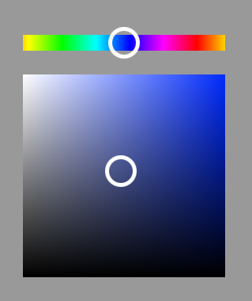

# MagiColour

MagiColour is a Python / PySide6 program on Windows for one tap colour selection on art programs. Currently the only supported program is Clip Studio Paint.

## Installation

The executable is downloadable on the releases page. [Link](https://github.com/pianissi/MagiColour/releases/latest)

In Clip Studio Paint, you will need to set a shortcut for Pick screen colour. Currently this is hardcoded and I plan to change that in future releases. You can set it in "File -> Shortcut Settings -> Menu commands -> Edit -> Pick screen colour". Currently it's hardcoded to "Ctrl+Shift+X"

## How to use

The program constantly checks for the colour of a pixel on screen. Typically this will be something that holds your current chosen colour. With this, when you press the hotkey, the application will open a popup hue cube to the current colour.

When open, while hovering you can shift the hue, and when dragging you can shift the saturation and value. On hotkey release the program will set the colour within the drawing program.

With Clip Studio Paint, this is done by sending a hotkey for the Pick screen colour shortcut, and then colour picking the hue cube to set the colour.

## Considerations
This works mainly by using AutoHotkey. You might get flagged by some applications or games due to this.

## Configuration

1. Before launching, edit config.yml to set the hotkey to your liking.

2. Set the "Pick screen colour" shortcut in Clip Studio Paint to "Ctrl+Shift+X". This is in "File -> Shortcut Settings -> Menu commands -> Edit -> Pick screen colour".

3. Launch the application through main.exe

4. Set the pixel to watch for the colour. This is done by going to the System Tray, and finding the icon for the application and selecting the option: "Select Watched Pixel". When you click down, it will set the place where you clicked to be the pixel to watch for.

## Contributing

Pull requests are welcome. For major changes, please open an issue first
to discuss what you would like to change.

## License

[GPL](https://choosealicense.com/licenses/gpl-3.0/)